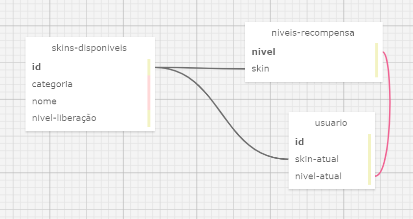

# Banco de Dados do Sistema de Gamificação do Oportoniza

A atividade apresentada foi desenvolvida pelo aluno Davi Nascimento de Jesus sob a instrução do professor orientador <a href="https://www.linkedin.com/in/cristiano-benites-687647a8/">Cristiano Benites</a>.

## Modelagem Conceitual
&nbsp;&nbsp;&nbsp;&nbsp;Tendo em vista o propósito de desenvolver um sistema de gamificação por customização de personagem, na plataforma Oportoniza, foi desenvolvido a modelagem conceitual dessa relação. Tal iniciativa foi composta pelo levantamento, análise e validação das informações que serão armazenadas no banco de dados. Essas informações foram visualmente representadas utilizando o Modelo Lógico-Relacional, que oferece uma visão realista da estrutura e organização dos dados do projeto. 

&nbsp;&nbsp;&nbsp;&nbsp;Assim, o sistema de gamificação para a plataforma Oportoniza foi concebido com o propósito de engajar os usuários envolvidos na promoção de uma cultura de transformação social e na atribuição de significado ao "ser voluntário". A customização seria feita através do pareamento com o level do usuário na plataforma. Desse modo, segue abaixo a modelagem dos dados, que foi realizada utilizando a ferramenta online  <a href="https://github.com/ondras/wwwsqldesigner">SQLDesigner</a>.

<div align="center">

<sub>Figura 1 - Modelo conceitual do banco de dados do sistema de gamificação do Oportoniza</sub>



<sup>Fonte: Material produzido pelo autor (2024)</sup>

</div>

```sql

-- Tabela "skins-disponiveis": Armazena informações sobre as skins que existem no sistema de gamificação
CREATE TABLE skins-disponiveis (
    id SERIAL PRIMARY KEY, -- Identificador único da organização
    categoria VARCHAR(50) NOT NULL, -- Categoria da skin
    nome VARCHAR(50) NOT NULL, -- Nome da skin
    nivel-liberação INTEGER REFERENCES niveis-recompensa(nivel) -- Nível de liberação da skin
);

-- Tabela "niveis-recompensa": Armazena informações sobre os usuários do sistema.
CREATE TABLE niveis-recompensa (
    nivel SERIAL PRIMARY KEY, -- Nível em que se recebe determinada skin
    skin INTEGER REFERENCES skin-disponiveis(id) -- ID da customização do mascote do usuário
);

-- Tabela "usuarios": Armazena informações, em relação às skins e aos níveis, sobre os usuários
CREATE TABLE usuarios (
    id SERIAL PRIMARY KEY, -- Identificador único do usuário
    skin-atual INTEGER REFERENCES skins-disponiveis(id), -- Skin atual do usuário
    nivel-atual INTEGER REFERENCES nivel-recompensas(nivel) -- Nível atual do usuário
);
```

&nbsp;&nbsp;&nbsp;&nbsp;Conforme tanto a sistematização desenvolvida na plataforma quanto o código descrito para a criação das tabelas essenciais para a relação, percebe-se que o banco de dados do sistema de gamificação da plataforma Oportoniza é composto por três tabelas principais que consistem em:

#### Tabela "skins-disponiveis":
&nbsp;&nbsp;&nbsp;&nbsp;Esta tabela armazena informações sobre as skins disponíveis no sistema de gamificação. Cada skin possui um identificador único (id), uma categoria que a classifica (categoria), um nome que a identifica (nome), e um nível de liberação (nivel-liberação) que indica em qual nível a skin é desbloqueada. A coluna id é a chave primária da tabela.

#### Tabela "niveis-recompensa":
&nbsp;&nbsp;&nbsp;&nbsp;Nesta tabela, são registradas as informações sobre os níveis de recompensa no sistema. Cada nível possui um identificador único automático (nivel), que também serve como chave primária. Além disso, há uma referência para a skin disponível associada a esse nível, através da coluna skin, que é uma chave estrangeira que se relaciona com o id na tabela "skins-disponiveis".

#### Tabela "usuarios":
&nbsp;&nbsp;&nbsp;&nbsp;Esta tabela armazena dados dos usuários da plataforma. Cada usuário é identificado por um número único automático (id), que é a chave primária da tabela. Além disso, cada usuário possui uma skin atualmente selecionada (skin-atual), que é uma referência para a tabela "skins-disponiveis" através do id, e um nível atual (nivel-atual), que é uma referência para a tabela "niveis-recompensa" através do número do nível (nivel).
Essas três tabelas compõem a estrutura básica do banco de dados da plataforma Oportoniza, permitindo o armazenamento e gerenciamento das informações necessárias para o sistema de gamificação e personalização de usuários.


&nbsp;&nbsp;&nbsp;&nbsp;Diante das tabelas dispostas, entende-se que o primor de um banco de dados se encontra na possibilidade de relacioná-las entre si, estabelecendo formatos de contato e sistemas de organização. Dessa forma, descreve-se as relações que se apresentam entre cada uma das tabelas abaixo:

#### Relação entre "skins-disponiveis" e "niveis-recompensa":
&nbsp;&nbsp;&nbsp;&nbsp;Esta relação é de (1:N) (um para muitos), onde várias skins disponíveis podem estar associadas a um único nível de recompensa. Isso é representado pela coluna nivel-liberação na tabela "skins-disponiveis", que referencia o número do nível na tabela "niveis-recompensa". Portanto, a tabela "niveis-recompensa" contém uma chave estrangeira que se relaciona com o número do nível (nivel) na tabela "skins-disponiveis".

#### Relação entre "usuarios" e "skins-disponiveis":
&nbsp;&nbsp;&nbsp;&nbsp;Na tabela "usuarios", a coluna skin-atual representa a skin atualmente selecionada pelo usuário. Essa coluna é uma chave estrangeira que referencia o id na tabela "skins-disponiveis". Isso estabelece uma relação de (N:1) (muitos para um), onde várias linhas na tabela "usuarios" podem referenciar a mesma skin na tabela "skins-disponiveis".

#### Relação entre "usuarios" e "niveis-recompensa":
&nbsp;&nbsp;&nbsp;&nbsp;Similarmente, a coluna nivel-atual na tabela "usuarios" representa o nível atual do usuário. Essa coluna é uma chave estrangeira que referencia o número do nível (nivel) na tabela "niveis-recompensa". Assim como na relação anterior, esta é uma relação de (N:1), onde várias linhas na tabela "usuarios" podem referenciar o mesmo nível na tabela "niveis-recompensa".

&nbsp;&nbsp;&nbsp;&nbsp;Portanto, as chaves estrangeiras são utilizadas para estabelecer e manter as relações entre as tabelas, garantindo integridade referencial e consistência nos dados. Isso permite que o banco de dados da plataforma Oportoniza mantenha uma estrutura coesa e funcional, facilitando a manipulação e recuperação das informações necessárias para o funcionamento do sistema de gamificação e personalização de usuários.

&nbsp;&nbsp;&nbsp;&nbsp;Entende-se, também, com a finalização desse raciocínio, o quão importante é a modelagem relacional para o desenvolvimento de bancos de dados de uma aplicação. É através desse processo que consegue se estabelecer uma relação eficiente entre os dados, de forma a promover a efetivação do propósito da plataforma. É proposto, com isso, que esse recorte desenvolvido para a atividade ponderada seja incorporado ao banco de dados geral da plataforma Oportoniza.